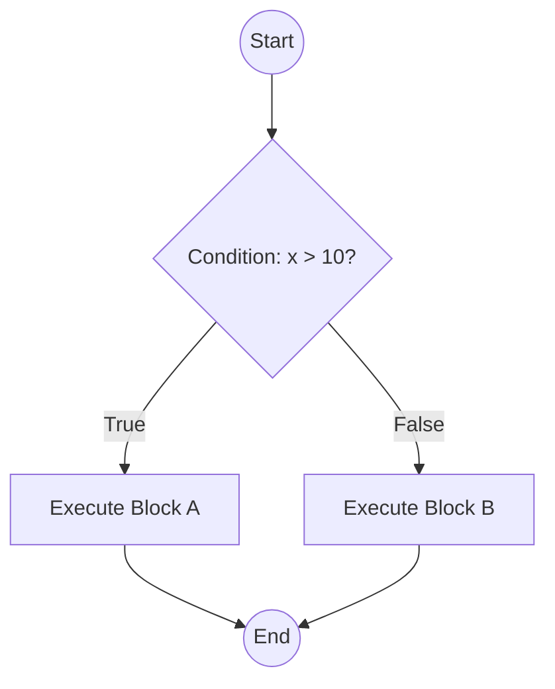

# Conditionals Deep Dive

## Control Flow Fundamentals
Standard execution processes instructions sequentially (top-to-bottom). Branching execution introduces non-linear paths based on boolean evaluations. The moment an `if` statement is encountered, the CPU evaluates the expression to derive a strict `True` or `False`.

## Sequential vs Branching Execution
- **Sequential**: Deterministic, $O(1)$ complexity regarding path choice. Every line executes.
- **Branching**: Introduces mutually exclusive paths. Code coverage drops; testing complexity increases.

## How the CPU Evaluates Conditions
The CPU evaluates boolean logic down to machine code jump instructions (`JMP`, `JE`, `JNE`). When writing `if a > b`, the CPU compares the registers. If the condition is met, it jumps over the `False` block. In competitive programming, evaluating complex conditionals inside tight loops can cause branch prediction misses, slightly degrading performance. Keep conditions simple.

## Control Flow Graph (CFG) Explanation
A CFG is a directed graph where nodes represent straight-line code (basic blocks) and edges represent jumps in the control flow. 

When analyzing time complexity, you trace the longest possible path (worst-case scenario) through your CFG.

## Boolean Algebra Basics
Boolean algebra operates on `True` (1) and `False` (0). 

### Truth Tables
**AND (`and`)**: Requires all inputs to be True.
| A | B | A and B |
|---|---|---------|
| 0 | 0 |    0    |
| 0 | 1 |    0    |
| 1 | 0 |    0    |
| 1 | 1 |    1    |

**OR (`or`)**: Requires at least one input to be True.
| A | B | A or B |
|---|---|--------|
| 0 | 0 |   0    |
| 1 | 0 |   1    |
| 0 | 1 |   1    |
| 1 | 1 |   1    |

## Decision Trees
For complex problems (e.g., determining a tax bracket based on age, income, and marital status), map the logic as a decision tree *before* coding. Every node is an `if/elif`, and the leaves are the final output. If your tree has unreachable leaves, your logic is flawed.
