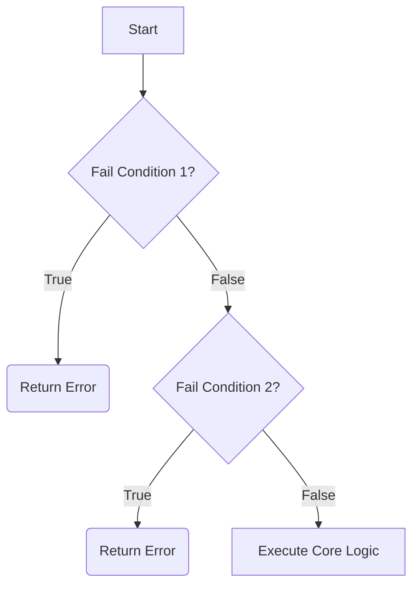

# Nesting and Control Flow Graphs (CFG)

## Nested `if` Logic
Nesting is placing an `if` statement inside the execution block of another `if` statement. While sometimes necessary, deep nesting creates the "Arrow Anti-Pattern", making code unreadable and bug-prone.

```python
# The Arrow Anti-Pattern
if user_exists:
    if password_correct:
        if account_active:
            print("Login success")
        else:
            print("Account suspended")
    else:
        print("Wrong password")
else:
    print("User not found")
```

## The Early Return Principle (Guard Clauses)
The most powerful refactoring tool in competitive programming is the **Early Return**. Instead of nesting the success conditions, you invert the logic and terminate (return/continue) on the failure conditions immediately.

### Refactoring to Guard Clauses:
```python
if not user_exists:
    return "User not found"
    
if not password_correct:
    return "Wrong password"
    
if not account_active:
    return "Account suspended"

# Straight-line code. No nesting required.
return "Login success"
```
This flattens the CFG, making it $O(1)$ to mentally parse.

## Flattening Nested Conditions
If you require a specific path but want to avoid deep nesting, mathematically combine the requirements using `and`.

**Nested:**
```python
if x > 0:
    if y > 0:
        print("Quadrant 1")
```
**Flattened:**
```python
if x > 0 and y > 0:
    print("Quadrant 1")
```

## Detecting Redundant Conditions
When using `elif`, remember that reaching an `elif` inherently means *all previous statements were False*.

**Redundant:**
```python
if score >= 90:
    print("A")
elif score < 90 and score >= 80: # Redundant: score < 90 is guaranteed
    print("B")
```
**Optimized:**
```python
if score >= 90:
    print("A")
elif score >= 80:
    print("B")
```

## Visual CFG Flattening
By using Early Returns, your CFG changes from a complex nested web into a sequential waterfall graph.

